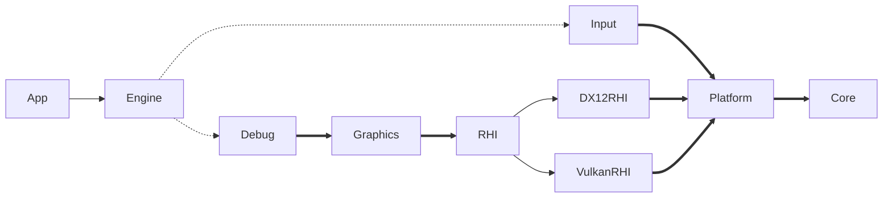

# Module Dependency

|線|依存性|説明|
|--|-----|----|
|━━▶|必須依存|依存先が存在しないと生成できません|
|──▶|選択依存|どちらかの依存先が存在する必要があります|
|⋯⋯▶|任意依存|依存先が存在する場合機能を有効化します|

モジュールの依存関係は各モジュールのCMakeLists.txtで設定されています。public_libsの設定を確認してください。