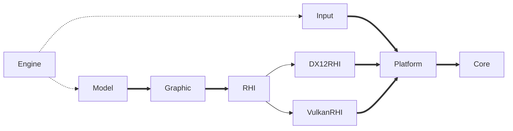

# DependencyGraph

|線|依存性|説明|
|--|-----|----|
|━━▶|必須依存|依存先が存在しないと生成できません|
|──▶|選択依存|どちらかの依存先が存在する必要があります|
|⋯⋯▶|任意依存|依存先が存在する場合機能を有効化します|

```mermaid

graph LR
    Engine-.->Model & Input
    Model==>Graphic==>RHI
    Input==>Platform==>Core

    RHI-->DX12RHI & VulkanRHI ==>Platform
```