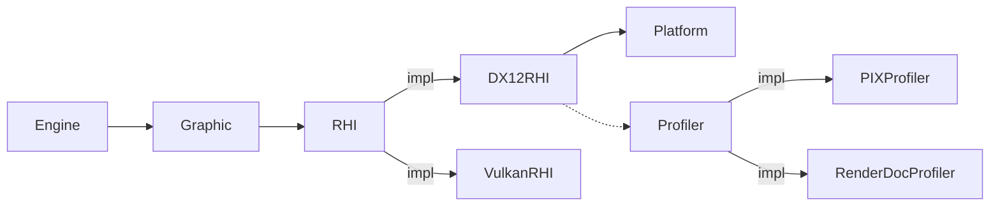

DI (Dependency Injection) {#DI}
============
## 概要
各Service(システム)は依存するServiceをRequireかOptionalから選択して設定します。  
* Require：必須依存
* Optional：任意依存

Serviceはインターフェイス化することもでき、複数の実装がある場合はプライオリティの高いServiceが選択されます。インターフェイスはRequire/Optionalどちらでも使用可能です。


Serviceの依存関係はコンストラクタの引数から判定されます。
|型|意味|
|-|-|
|T&|必須依存|
|T*|任意依存|

## 実装例

```cpp
class RHI{};
class DX12RHI:public RHI{   public: DX12RHI(Platform&,Profiler*); };
class Grahics{   public: Graphics(RHI&); };
class Engine{   public: Engine(Graphics&,Sound&);  };

int main(){

    ServiceInjector injector;
    // 中略
    injector.bind<DX12RHI>().as<RHI>();
    injector.bind<Graphics>();
    injector.bind<Engine>();
    
    ServiceContainer container;
    auto engine = injector.create<Engine>(container);
    
    return 0;
}
```

# Serviceの登録方法
Serviceは```ServiceInjector::bind<T>()```を使用して登録します。  
```cpp
ServiceInjector injector;
injector.bind<Service>();
```
## インターフェイスの登録
インターフェイスを登録する場合は```as<T>()```を使用してどのインターフェイスにバインドするかを指定します。
インターフェイスをcreateした場合はServiceInjectorに先に登録したServiceから構築が試みられます。そして最初に構築に成功したServiceがインターフェスに対応したServiceとして扱われます。
```cpp
ServiceInjector injector;
injector.bind<ServiceA>().as<IService>();
injector.bind<ServiceB>().as<IService>();

ServiceContainer container;
injector.create<IService>(container);

container.get<IService>(); // ServiceAが取得される
container.get<ServiceA>(); // ServiceAが取得される
```
インターフェイスとして登録したものを具象クラスとしてcreateすることも可能です。
```cpp
ServiceInjector injector;
injector.bind<ServiceA>().as<IService>();
injector.bind<ServiceB>().as<IService>();

ServiceContainer container;
injector.create<ServiceB>(container);

container.get<IService>(); // ServiceBが取得される
container.get<ServiceB>(); // ServiceBが取得される
```

## 非公開サービスの登録
外部に公開していない内部的なServiceを登録する場合はRegister関数を使用します。
```cpp
void func() {
    ServiceInjector injector;
    SomeService::Register(injector);
}

void SomeService::Register(ServiceInjector& injector) {
    injector.bind<SomeService>();
    injector.bind<InternalSomeService>();
}
```

## 生成済みのインスタンスの登録
生成済みのインスタンスを登録することも可能です。おもにConfigを登録する場合に使用します。
```cpp
struct Config {
    bool debug;
};
class Service {
public:
    Service(Config* config) {
        if (config && config.debug) {
            // デバッグ用処理
        }
    }
};

void func() {

    Config config;
    config.debug = true;

    ServiceInjector injector;
    injector.bind(config);
    injector.bind<Service>();

    ServiceContainer container;
    injector.create<Service>(container);

}
```
生成済みのインスタンスの寿命はServiceContainerは管理しません。必ずServiceContainerより後に破棄してください。
```cpp
void func() {

    ServiceInjector injector;
    {
        Config config;
        config.debug = true;
        injector.bind(config);

        // Configの寿命はここまで
        // create時に無効なポインタが渡されるため危険
    }
    injector.bind<Service>();

    ServiceContainer container;
    injector.create<Service>(container);

}
```


# Serviceの生成キャンセル
必須のServiceが生成されていない場合はコンストラクタから例外を送信することで生成をキャンセルすることができます。  
```cpp
struct Base{};
struct A:Base{
    A(){
        throw Exception();
    }
};
struct B:Base{
    B(){
    }
};
struct C{
    C(Base& base) {
        // baseはBのインスタンス
    }
};

void func(){
    ServiceInjector injector;
    injector.bind<Base>.as<A>();
    injector.bind<Base>.as<B>();
    injector.bind<C>();

    ServiceContainer container;
    injector.create<C>(container);    
}

```