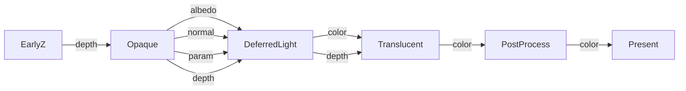

# FrameGraph {#FrameGraph}

## FrameGraphとは？

FrameGraphとは、 **各描画パス（Pass）をノードとし、依存関係をエッジとして持つ** ような **有向非巡回グラフ（DAG）** で、レンダリングの全体フローを構築・管理するシステムです。

GDC 2017のFrostbiteの [FrameGraph: Extensible Rendering Architecture in Frostbite](https://www.gdcvault.com/play/1024612/FrameGraph-Extensible-Rendering-Architecture-in) の講演に基づきます。

### 主な機能・役割：

| 機能            | 説明                                                      |
| ------------- | ------------------------------------------------------- |
| 📦 リソーストラッキング | テクスチャ、バッファなどの**仮想リソースを自動で管理**し、必要な時点で物理リソースを割り当てる（遅延割当） |
| 🔄 依存関係解析     | **Pass間の読み書き依存関係**から描画順序を自動決定                           |
| 🧹 ライフタイム最適化  | 使用されなくなったリソースは破棄 or 再利用（**リソースの寿命管理**）                  |
| 🧪 バリア挿入      | グラフィクスAPI（DirectX12, Vulkan等）における**必要なバリアやシンクの自動挿入**    |
| 🧵 並列実行の最適化   | パスの依存性グラフに基づき**非依存パスを並列実行可能**にする                        |
| 🧰 デバッグ支援     | FrameGraphから**可視化ツール**を生成可能にし、各Passやリソースの状態を視認可能        |

---

## 構成の概要（例）

以下のような概念的なフローを構築：



各パスは明示的に「何のリソースを読み、何を出力するか」を宣言。FrameGraphが依存関係とリソースの寿命を自動的に解決します。

## 特徴的な思想

1. **記述型（Declarative）API**：
   - 描画処理を **「何をしたいか」中心に記述** し、「いつどうやるか」はFrameGraphに任せる。

2. **物理リソースと論理リソースの分離**：
   - `RenderTargetA`などを仮想的に定義し、FrameGraphがバックで実体を最適化して割り当てる。

3. **最小限のオーバーヘッドで可搬性・保守性向上**：
   - パス同士が密結合しないため、**機能追加やレンダリング手法の変更に強い**。

## 影響を受けた/与えた代表的なシステム

| フレームワーク                          | 備考                                                           |
| -------------------------------------- | -------------------------------------------------------------- |
| Unity SRP (Scriptable Render Pipeline) | FrameGraph的構造を取り入れている                                 |
| Unreal RDG (Render Dependency Graph)   | 明示的なPass/Resource構造、遅延実行、グラフ構築など多くの共通点あり |

# 実装方法
各パスは```Input```と```Output```を定義する必要があります。
```cpp
class OpaquePass : public RenderPass {
public:
   struct Input {
      FGResource albedo;
      FGResource normal;
      FGResource depth;
   };
   struct Output {
      FGResource albedo;
      FGResource normal;			
      FGResource depth;
   };
public:
   OpaquePass();
   Output render(FG& fg, RenderView& view, Input input)const;
};

class SampleRenderPipeline {
public:

   void render(FG& fg, RenderView& view) {

      auto earlyZ = m_earlyZ.render(fg, view, {});
      auto opaque = m_opaque.render(fg, view, { earlyZ.albedo , earlyZ.normal, earlyZ.depth });
      auto masked = m_masked.render(fg, view, { opaque.albedo , opaque.normal, opaque.depth });
      auto deferred = m_deferred.render(fg, view, { masked.albedo,masked.normal,masked.depth });
      auto imgui = m_imgui.render(fg, view, { deferred.color });

      bool useImGui = true;

      auto camera = m_camera.render(fg, view, { useImGui ? imgui.color : deferred.color});

   }

private:
   EarlyZPass m_earlyZ;
   OpaquePass m_opaque;
   MaskedPass m_masked;
   DeferredPass m_deferred;
   ImGuiPass m_imgui;
   CameraPass m_camera;
};

```