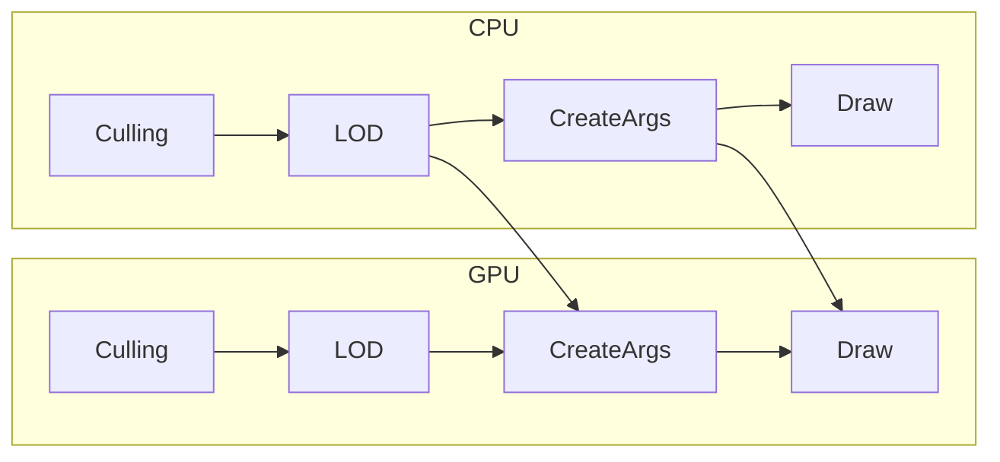

RenderEngine {#RenderEngine}
----------

## 描画戦略
| Pass        | Strategy            |
|:------------|:--------------------|
| Opaque      | マテリアル毎にまとめる         |
| Translucent | 描画順ソートを行いインスタンシングなし |

## Instanced Static Mesh
* 動的インスタンシングの対象外
* グループ内での描画順ソートもなし
    * 半透明を表現したい場合はディザ必須

## GPU駆動レンダリング
どの描画フェイズからGPU駆動にするかを切り替えられるようにする設計です。
* カリング
* LOD選択
* 描画引数生成(動的インスタンシング)
* 描画コマンド

