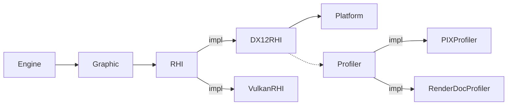

DI (Dependency Injection)
============
各モジュールは依存するモジュールをRequireかOptionalから選択して設定します。  
* Require：必須依存
* Optional：任意依存

モジュールはインターフェイス化することもでき、複数の実装がある場合はプライオリティの高いモジュールが選択されます。インターフェイスはRequire/Optionalどちらでも使用可能です。


モジュールの依存関係はコンストラクタから判定されます。

```c++
class RHI{};
class DX12RHI:public RHI{   public: DX12RHI(SPtr<Platform>,SPtr<Profiler>); };
class Grahic{   public: Graphic(SPtr<RHI>); };
class Engine{   public: Engine(SPtr<Graphic>,SPtr<Sound>);  };

int main(){

    ServiceInjector injector;

    FileLogger logger;
    injector.add<RHI>().to<DX12RHI>();
    injector.add<Graphic>();
    injector.add(logger);
    
    ServiceContainer container;
    auto engine = injector.create<Engine>(container);
    engine->setServiceContainer(container);

    // 最後に生成されたRHIを使用して生成
    Texture::White();


    return 0;
}

```
# ServiceInjectorへの登録
必須依存のサービスをServiceInjectorに登録する責務はそのサービスにあります。
登録用の関数を使用すると内部的に必要なサービスが登録されます。
```cpp
void func(){
    ServiceInjector injector;
    ob::graphic::Register(injector);

    ob::rhi::dx12::Register(injector);
}
//-----------------------------------------------------
void ob::graphics::Register(ServiceInjector& injector){
    injector.bind<Graphics>();
    injector.bind<EmptyRHI>();
}
void ob::rhi::dx12::Register(ServiceInjector& injector){
    injector.bind<DX12RHI>();
    injector.bind<Platform>();
}
```


# サービスの生成キャンセル
必須のサービスが生成されていない場合はコンストラクタから例外を送信することで生成をキャンセルすることができます。  
```cpp
struct Base{};
struct A:Base{
    A(SPtr<Req> req){
        if(!req){
            throw Exception();
        }
    }
};
struct B:Base{
    B(){

    }
};
struct C{
    C(SPtr<Base>);
}

void func(){
    ServiceInjector injector;
    injector.bind<Base>.to<A>();
    injector.bind<Base>.to<B>();
    injector.bind<C>.toSelf();
    injector.create<C>();
    // Cに渡されるのはB
}


```

# 生成単位
```
Engine
    Editor
        Tool[]
            World
    Game
        World
```
## Engine
* シングルトンです。

```
Engine::GetService<T>();
```

## Editor
* シングルトンです。  
* エディタ起動の場合のみ生成されます。

```
Editor::GetService<T>();
```

## Game
* シングルトンです。
* ランタイム起動の場合のみ生成されます。
  * スタンドアロン起動
  * プレビュー
* ゲームプレビューとカットシーンプレビューは併用できません。

```
GameInstance::GetService<T>();
```

## World
* ワールドの数だけ生成されます
  
```
entity->getWorld()->getService<T>();
```

# エディタツールの扱い
* 複数アセットを同時編集する場合はツールごとにWorldが生成されます
  * ツール内で複数のWorldが生成される場合もあります
* エディタ起動の場合はGameのサービスは生成されません