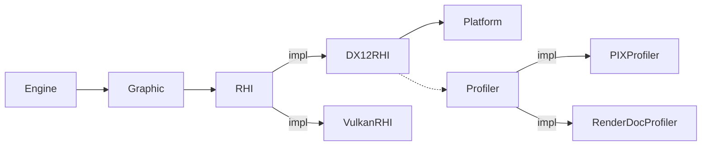

DI (Dependency Injection)
============
各モジュールは依存するモジュールをRequireかOptionalから選択して設定します。  
* Require：必須依存
* Optional：任意依存

モジュールはインターフェイス化することもでき、複数の実装がある場合はプライオリティの高いモジュールが選択されます。インターフェイスはRequire/Optionalどちらでも使用可能です。


モジュールの依存関係はコンストラクタから判定されます。

```c++
// Singletonは参照型でのみ受け取る (T&, const T&)
//
// UniqueはSPtrで受け取る (SPtr<T>,SPtr<const T>)
// ※参照管理するため
//
// Instanceは非対応(T)
class RHI{};
class DX12RHI:public RHI{
public:
    DX12RHI(SPtr<Platform>,SPtr<Profiler>);
};

class Profiler{};
class PIXProfiler:public Profiler{
public:
    PIXProfier(){

    }
};

class Grahic{
public:
    Graphic(SPtr<RHI>){

    }
};


class Engine{
public:
    Engine(SPtr<Graphic>,SPtr<Sound>){

    }
private:

};

int main(){

    // 全ての依存物はcreate毎に生成
    // シングルトンとして追加する場合はインスタンスを指定
    // => シングルトンが非シングルトンに依存してはいけないため
    // 
    FileLogger logger;

    ServiceInjector injector;
    injector.add<RHI>().to<DX12RHI>();
    injector.add<RHI>().to<VulkanRHI>();
    injector.add<Profiler>().to<PIXProfiler>();
    injector.add<Graphic>();
    injector.add(logger);
    
    auto engine1 = injector.create<Engine>();

    // Engineを起点に生成すると依存先をエンジンより後に解放しないといけない

    // ユーティリティを使用する場合どこかにインスタンスを保持する必要がある
    Texture::White();


    return 0;
}

```

```cpp
class RHI{
public:
    static RHI* Get(){
        return s_rhi;
    }

    RHI(){
        s_rhi = this;
    }
};

class Texture{
public:
    static Ref<Texture> White(){

        GEngine->get<RHI>()

    }
};

```