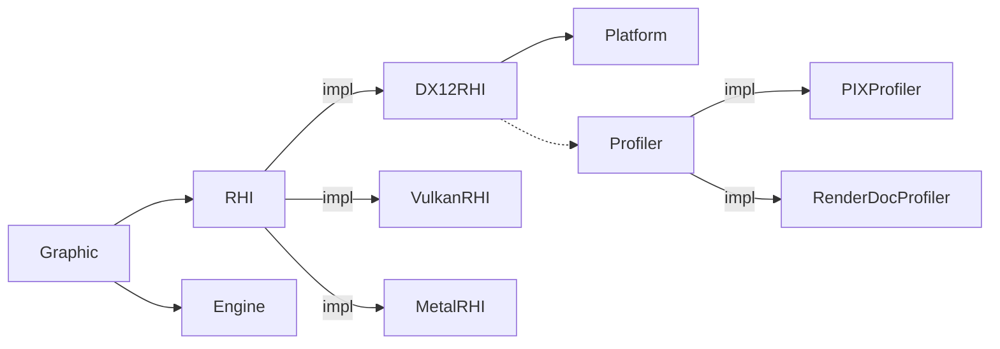
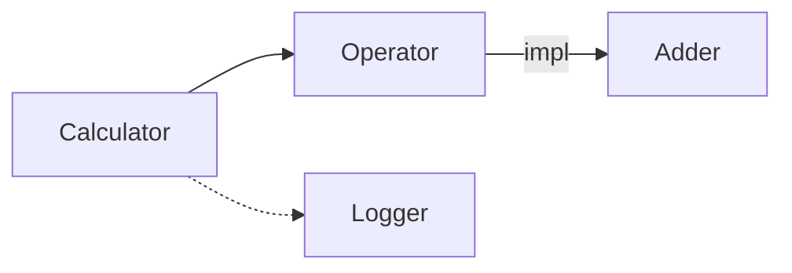
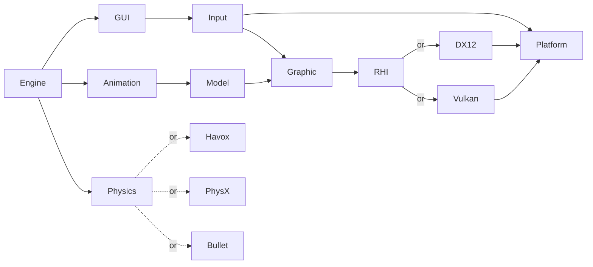

DI (Dependency Injection)
============
各モジュールは依存するモジュールをRequireかOptionalから選択して設定します。  
* Require：必須依存
* Optional：任意依存

モジュールはインターフェイス化することもでき、複数の実装がある場合はプライオリティの高いモジュールが選択されます。インターフェイスはRequire/Optionalどちらでも使用可能です。




モジュールの依存関係はDependencyGraphに登録します。DependencyGraphには構築可能なクラスと構築済みのインスタンスのみ登録できます。


```c++

class DX12RHI{
public:
    static void Register(DependencyGraph& graph){
        graph.add<DX12RHI>()
            .as<RHI>()
            .require<Engine>()
            .require<Platform>()
            .optional<Profiler>();
    }
public:
    DX12RHI(ServiceContainer& container);
}


class Engine{
public:

    void startup(){

        DependencyGraph graph;
        graph.add(*this);
        DX12RHI::Register(graph);
        
        m_container = {graph};
    }

private:
    ServiceContainer m_container;
}

```


# App

EngineからアクセスするのでなくEngineが必要とする者だけが作られる。  
作成可能なものをすべて登録はするが実際に生成されるのはEngineが参照しているもののみ。


```cpp
DependencyGraph graph;
graph.add<RHI>().with<DX12RHI>();
graph.add<RHI>().with<VulkanRHI>();
graph.add<Graphic>();

Engine engine{graph};
GEngine = &engine;

auto texture = Texture::White();


DependencyGraph graph;
// add interface to implement
```
boost::diでコンストラクタが例外を出した場合に別の実装を使用させることはできますか？
例えば
auto injector = boost::di::make_injector(
    boost::di::bind<Interface>.to<Implementation1>(),
    boost::di::bind<Interface>.to<Implementation2>(),
);
auto obj = injector.create<std::unique_ptr<Interface>>();
としたときにImplementation2の生成に失敗した場合にImplementation1を使用するようにしたいです。