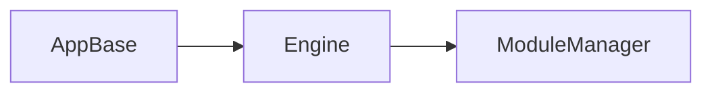

Engineモジュール
================
Coreモジュールが特定のマネージャに依存しないクラスが集められているのに対して、Engineモジュールでは
ゲームループやモジュールの更新など、システムの基幹部分が実装されています。  


## モジュールの設定
```cpp
// GEngine::Register<RHIModule>();
REGISTER_MODULE(DirectXRHIModule,RHIModule);
```

```cpp
void OctbitInit(InitContext& context){

	IniReader ini(path);

	context.setModulePriority<DirectX12RHIModule>(0);

	{
		graphic::Settings settings;
		settings.api = ini.get("graphic","api");
		settings.bufferSize = 2;
		settings.debugHeapSize = 0x10000;
		context.set(settings);
	}
	{
		platform::Settings settings;
		settings.procHock = MyWindProc;
		context.set(settings);
	}
}

void OctbitMain(){
	graphic::Texture texture("test.dds");
}

```
## マルチスレッド
モジュールの生成を複数スレッドから行えるようにするとEngine内でロックを書ける必要が出てくる。
しかしモジュールの生成は各モジュールに対して1回だけなので、事前にシングルスレッドで生成すればロックなしにできる。
