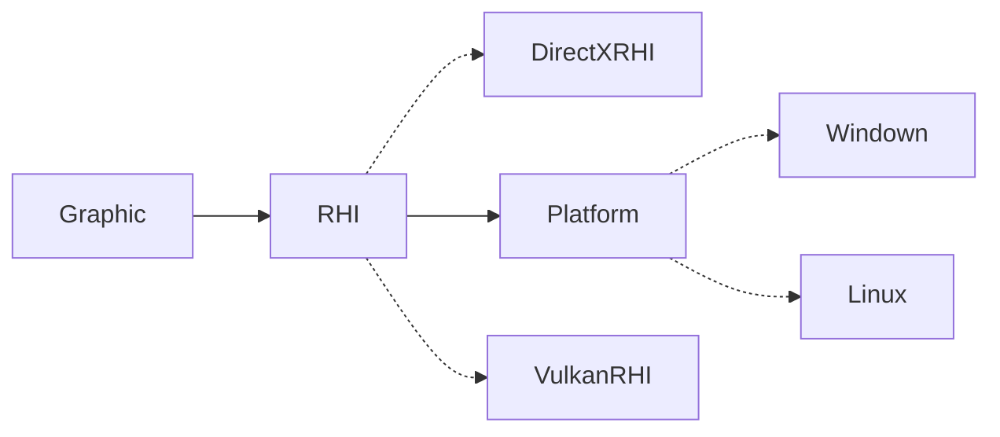
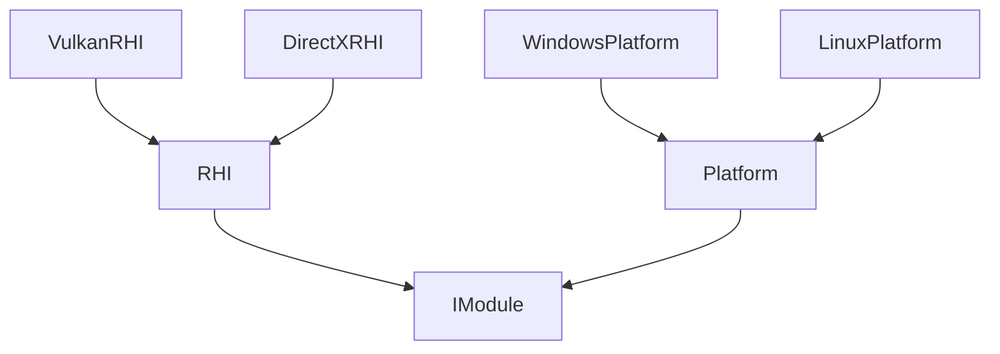

モジュール
==========

## ModuleとPlugin
* PluginはDLLと同義
* Plugin内に複数のModuleを含むことが可能
* 全てのPluginは必ず生成されるがModuleは設定に応じて生成する

## モジュールの種類
モジュールの依存は以下の二つに分けられる
* Require 必須(EffectはRenderが必須)
* Optional 任意(PhysicはRenderがあればGPGPUを使用)

依存関係をなくすためにできるだけOptionalで実装するのが望ましい。

共通したインターフェイスを持つモジュールは

## 実装上の注意
* ```module.config```がなくても依存モジュールを設定可能

## モジュールの登録
```cpp
// モジュールのコンストラクタ登録
manager.registerModule<DirectXModule,RHIModule>();

// DLLから登録
for(auto path:pathes){
	auto& dll = dlls.emplace_back(path);
	if(auto func = dll.getFunction("RegisterModule")){
		func.call(manager);
	}
}

// モジュール生成オプション設定
manager.setOptions(options);

// 生成
manager.addModule<GraphicModule>();


```

## module.config
エディタで使用するファイル。
```json
{
	"pathes":[
		"Modules/PlatformModule.dll",
		"Modules/GraphicModule.dll",
		"Modules/RHIModule.dll",
		"Plugins/DirectXModule.dll",
		"Plugins/VulkanModule.dll",
	],
	"options":{
		"RHIModule":{
			"bufferSize":"100000",
		},
		"DirectXModule":{
			"priority":1,
		},
		"VulkanModule":{
			"priority":0,
		}
	}
}
```

## 更新順
* Initialize (単体初期化)
* Setup (他モジュール依存する部分の初期化)
* Start (Play時の初期化)
* Update (フレーム更新)
* Terminate(他モジュール依存する部分の解放)
* Finalize (単体開放)

## マルチスレッド戦略
*制作予定*  
モジュール間で依存関係がない場合は並列に更新できるようにする  
JobSystemの実装に合わせる


## 読み込みパターン
* プログラム上で明示的に追加
    * [WIP]
* リリース時のコンフィグ(バイナリ)から
    * AppBase内
* エディタ時の切り替え
    * ランタイムを再起動
---
* ModuleはEngineに追加していく
* EngineにはバイナリやJSONからモジュールを読み取る機能はない
    * AppBaseが読み込みを担当
## モジュール設定
* モジュールのオプションは事前に設定する
* 

```cpp
class GraphicModule:public IModule{
public:
	static void Register(Engine& engine){
		engine.registerModule("GraphicModule")
			.addDetails("描画用モジュール")
			.addRequired<PlatformModule>()
			.addOptional<RHIModule>();
	}
public:
	Graphic(Engine& engine)
		: IModule(engine)
	{
		engine.add<RHIModule>(GraphicAPI::DirectX);
	}
}

class TestPlugins:public IPlugin{
public:
	TestPlugins(Engine& engine){
		GraphicModule::Register(engine);
	}
}
```
```cpp
class RHIModule:public IModule{
public:
	struct Options{
		RHIType type;
		size_t bufferSize;
	};
public:
	RHIModule(Engine& engine)
		: IModule(engine)
	{
		// 必須モジュールはコンストラクタで追加
		auto platform = engine.add<PlatformModule>();

		auto settings = engine.getOptions<Options>();
		switch(settings.type){
		case RHI::DirectX:
		
			m_dll = DLL(GetRHIDLLPath(api));
			m_rhi = dll.get<RHIBase>()->createRHI();
			
			break;
		}

	}
private:
	UPtr<RHI> m_rhi;
	DLL m_dll;
}
```

```cpp
class Editor{
public:
	Editor(){
		JSONReader reader;
		
		ModuleSettings settings = reader.read();
		App app = App(settings);
	}
	App app;
};

class Runtime{
public:
	Runtime(){

	}
	App app;
};

class App:AppBase{
public:
	App(Settings settings){
		addModule<GraphicModule>();
		addModule<ModelModule>();
	}
};


```
依存グラフ

継承グラフ

