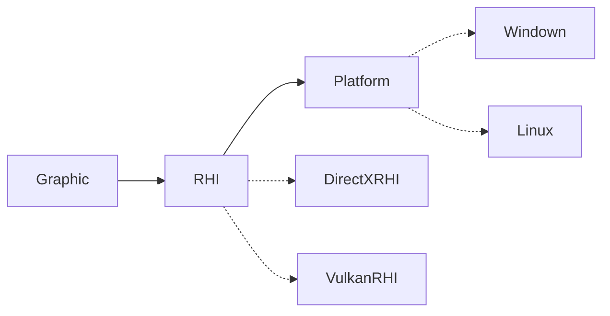
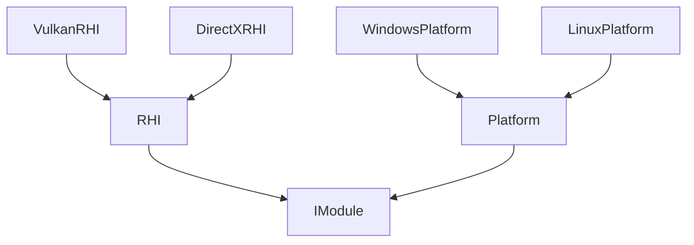

モジュール
==========
依存グラフ

継承グラフ


```cpp
class GraphicModule:public IModule{
public:
	Graphic(Engine& engine)
		: IModule(engine)
	{
		engine.add<RHIModule>(GraphicAPI::DirectX);
	}
}

class RHIModule:public IModule{
public:
	RHIModule(Engine& engine,GraphicAPI api)
		: IModule(engine)
	{
		auto platform = engine.add<PlatformModule>();
		
		m_dll = DLL(GetRHIDLLPath(api));
		m_rhi = dll.get<RHIBase>()->createRHI();
	}
private:
	UPtr<RHI> m_rhi;
	DLL m_dll;
}
```

```cpp
class App:AppBase{
public:
	App(){
		{
			RHIModuleOptions options;
			options.api = RHIAPI::DirectX12;
			setOptions(options);
		}
		addModule<GraphicModule>();
	}
}


```