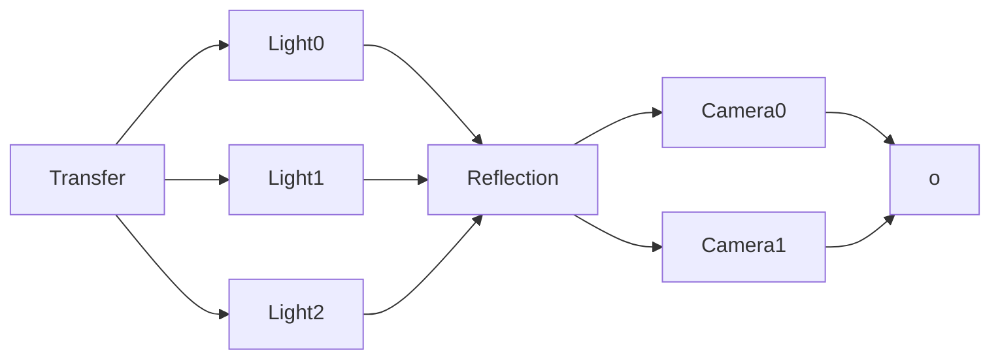

RenderPipeline
---------------
1フレーム中の描画処理はカメラに依存するものとそうでないものに分けられる。

### CameraStack
別カメラの映像を背景を描画せずにオーバーレイさせるシステムです。  
CameraStackに積まれたカメラの描画はPostProcessとの依存関係を考慮して描画されます。
オーバーレイ描画のポストプロセスはベースカメラと同一です。

### カメラごとのRenderPipeline
PBRとNPBRを両方使用する場合はカメラごとにRenderPipelineを構築する必要があります。  
RenderPipelineが異なる場合RenderPassも異なるのでMaterialはPRBとNPRBの両方に対応する必要があります。
具体的にはRenderTagに```PBR_Opaque```と```NPBR_Opaque```それぞれのシェーダを含める必要があります。
```c++
if(camera.hasTag(TC("PBR"))){
	context.getRenderers(TC("PBR_Opaque"))
		.sort(soptions)
		.cull(coptions)
		.draw();
	// ...
}else{
	context.getRenderers(TC("NPBR_Opaque"))
		.draw();
	// ...
}
```

### Camera情報
一般的なパラメータはCameraコンポーネントが持つ。
カスタムRenderPipelineで必要なパラメータはCameraと同じEntityにコンポーネントとして追加する。  
例：AdditionalCameraDataComponent


### Engine実装とGame実装
RenderPipelineにはシステム予約してあるRenderTagの描画を用意しておく。  
Engine実装で実現できないものがある場合は別のRenderTagを用意し個別実装する。
* ```drawShadow()```
* ```drawSky()```
* ```drawUI()```
* ```drawWireframe()```
* ```drawGizmo()```

### サンプル

```c++

class SampleRenderPipeliene : public RenderPipeline{
public:
	// システム的なGPGPU処理はrender前に実行される
	// IMGUIなどのデバッグ描画はrender後に実行される
	void render(RenderContext& context, Span<Camera> cameras) override {
		
		// カメラ由来ではない処理(例：GI/Sea)
		
		// カメラごとの描画
		for(auto& camera:cameras){
			
			auto size = camera.getRenderTexture().size();

			context.setCamera(camera);

			static Name opaqueName(TC("Opaque"));
			context.beginRenderPass(opaqueName,size,);
			camera.renderPipeline(context,camera,);

			context
				.getRenderers("Opaque","Cutoff")
				.cull()
				.sort()
				.draw();

		}
	}

};
```

## 描画リソースの管理
* 描画テクスチャはRenderer(Camera)毎に名前で管理する
* RenderPassは全体で共通
	* RenderPassの登録はRendererの生成とは分離する必要がある
	* FrameBufferはRendererFeatureの組み換えで変わる場合がある？
```c++
class Renderer{
public:
	Ref<RenderTexture> findRenderTexture(Name name){
		Ref<RenderTexture> fallback;
		return try_find(m_renderTextures,fallback);
	}
private:
	Map<Name,Ref<RenderTexture>> m_renderTextures;
};
```

# RenderPipelineの構造
```
RenderScene
    RenderPipeline[]
        RenderFeature[]
        RenderStep[]
            RenderPass	
	RenderView[]
		Texturemanager
			RenderTexture[]
    RenderItem[]
    Light[]
```

```
RPI
    RenderFeature[]
		MeshRenderFeature
		LightRenderFeature
		ShadowRenderFeature
		ImGuiRenderFeature	
	RenderView[]
		Texturemanager
		RenderStep[]
	RenderTaskList
		RenderTask[]
```


# 参考
## O3DEでの構造
https://www.docs.o3de.org/docs/atom-guide/dev-guide/rpi/rpi-system/
```
Scene
	FeatureProcessor[]
	RenderPipeline[]
		PipelineViews[]
			View[]
	PipelineState[]
```



```cpp
class LightRenderFeature{
public:
	void render(){
		for(auto& light:m_lights){
			light.render();
		}
	}
};
class ReflectionRenderFeature{
public:
	void render(){
		for(auto& probe:m_probe){
			probe.render();
		}
	}
};
class CameraRenderFeature{
public:

	CameraRenderFeature(LightRenderFeature* lightRF,ReflectionRenderFeature* reflectionRF){

	}

public:
	void render(){
		auto baseId = std::max({lightRF->getLastPathId(),reflectionRF->getLastPathId()});

		for(auto& camera:m_cameras){
			camera.render(baseId++);
		}
	}
};

class RenderPath{
public:
	void render(){
		for(auto& task:taskList){
			task.execute();
		}
	}
}

struct SortKey{
	u16  pathID;
	u8   renderTag;
	u8   ofset;
	u32  priority;
}
```