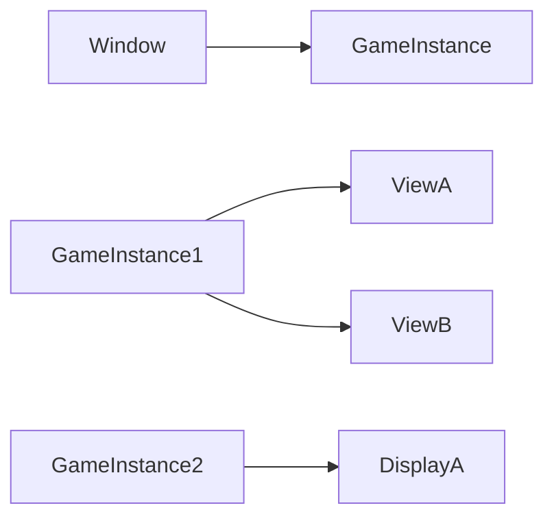

Input
=========

## ネイティブデバイス
トリガー/スカラー/ベクトルなどのイベントを受け取る
* Keyboard
* Mouse
* Joypad

# インプットデバイス
ネイティブデバイスの入力を各種イベントにバインドすることで複数の入力方法をサポートする。

# コード例
キーボード
```c++
// 固有
Keyboard::Focus();
// ボタン入力
Keyboard::Space.down();
```
マウス
```c++
// 軸入力
Vec2 pos = Mouse::GetPos();
Mouse::X.bind(handle,func);
// ボタン入力
Mouse::Left.down();
Mouse::Left.bindDown(handle,func);
// 固有
Mouse::SetPos(pos);
Mouse::SetVisible(true);
Mouse::SetLoop(rue);
Mouse::SetCursor(CursorMode::Hand);
Mouse::SetLockMode(MouseLockMode::Locked);
Mouse::IsConnected();
```
ゲームパッド
```c++
// 固有
GamePad().vibrate(1.5f,100.0f,wave);
GamePad(0).isConnected();
// 入力
GamePad(0).Left.bindDown(handle,func);
GamePad().Left.down();

Vec2 ls=GamePad().GetLStick();
GamePad().BindLStick();

```
バインディング
```c++
Player::Player(){
    // Player破棄時にバインドを解除するためハンドルが必要
    // InputComponentを経由する場合Behaviorにハンドルはいらないはず
    Keyboard::Space.bindDown(m_handle,{*this,&Player::onJump});
    Gamepad(0)::F.bindAxis(m_handle,{*this,&Player::onMove});
}
void Player::onJump(){
    LOG_INFO("Jump!!");
}
void Player::onMove(Vec2 value){
    LOG_INFO("Move[{}]",value);
}

```
マッピング
```c++
// Static
ActionMapper::registerKey(Keyboard::Space);
// Manager
ActionMapper mapper;
mapper.addAction("Jump",Keyboard::Space);
mapper.addAction("Jump",GamePad(0).A);
// Component
mapper.bindAction("Jump",func);
```

# 複数ウィンドウ(インスタンス)での入力の取り扱い
通常のゲームであればウィンドウフォーカスを考慮せずに入力を取り扱えばいいが、エディタで使用する場合は複数のインスタンスが立ち上がるため入力判定時にフォーカスされているかを判定する必要が出てくる。
```c++
Keyboard::Space.down(window);
Keyboard::Space.bindDown(window,handle,func);

if(window.focused()){
    
}

```

