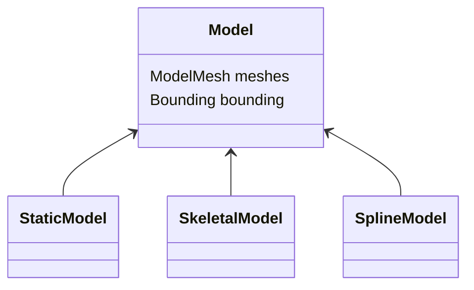

Model
=====

## 構成

```mermaid
classDiagram
    Model <-- StaticModel
    Model <-- SkeletalModel
    Model <-- SplineModel

    Model : ModelMesh meshes
    Model : Bounding bounding
```


```c++
class BaseMesh{
    void setOpacity(f32);
    void setColor(Color);
}
class StaticMesh{

}

```

# モデルに必要な情報
* メッシュ
* マテリアル
* 色
* 各ボーンのトランスフォーム
* ブレンドシェイプのウェイト