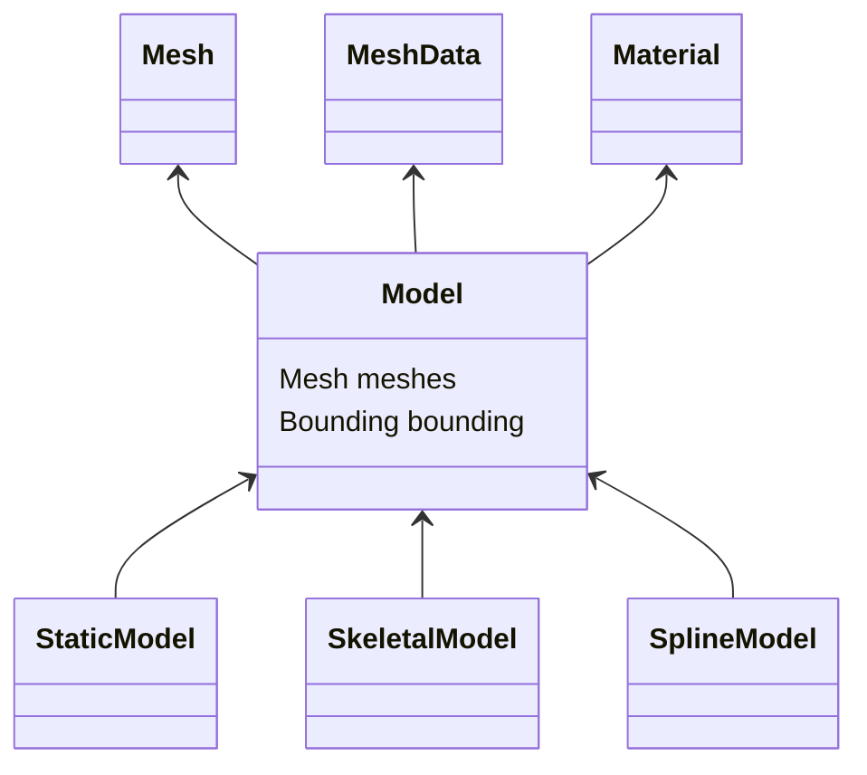

Model
=====

## 構成



```c++
class BaseMesh{
    void setOpacity(f32);
    void setColor(Color);
}
class StaticMesh{

}

```

# モデルに必要な情報
* メッシュ
* マテリアル
* 色
* 各ボーンのトランスフォーム
* ブレンドシェイプのウェイト
* LOD情報
* 


# クラス概要
### Model
* マテリアル配列を持つ
* メッシュを持つ
* マテリアルはメッシュのサブメッシュに対応する

### Mesh
* 頂点フォーマットを決める
* サブメッシュを持つ

### Submesh
* マテリアルと対応する


|OctbitEngine|Blender|
|-|-|
|Scene/Prefab|Scene|
|Model|Object|
|Mesh|Mesh|
|Material|Material|

fbxはModelとして読み込むことはできない。
fbx自体がシーングラフとして扱われるためシーン、ないしはプレハブとしてインポートされる。
オプションとしてマージして1つのMeshとしてインポートすることは可能。