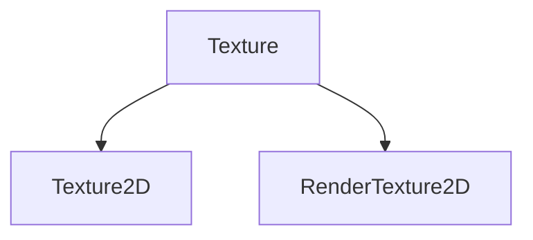

RHIモジュール
====================

## 概要
RHIモジュールではDirectXやVulkanなどの異なる描画APIの共通化を行います。

## 構成
### IGraphicModule
異なる描画APIを生成するシングルトンです。
起動時に描画APIを指定することで対応するグラフィック・モジュールを読み込み、各描画APIで実装されたDeviceを取得します。

### Device
グラフィック・オブジェクトを生成するファクトリクラスです。
実装はプラグインで行い、各種グラフィック・オブジェクトを実装した派生オブジェクトを生成します。
Device事態はGraphicModuleから生成されます。

## リソース
リソースは大別して三種類あります。
### Read
* 頂点
* インデックス
* テクスチャ
### ReadWrite
* レンダーターゲット
### ReadWrite
* Unoredered Access

```cpp
Window window(WindowDesc());

SystemDesc sysDesc;
sysDesc.api = GraphicAPI::DirectX12;
sysDesc.bufferNum = 2;
System::Get().initialize(sysDesc);

Display display;
{
	SwapchainDesc desc;
	desc.window=window;
	display=Display(desc);
}

RenderTexture rt;
{
	TextureDesc colorDescs[1];
	colorDescs.size=window.getSize();
	rt=RenderTexture(colorDesc);
}

RenderPass renderPass;
FrameBuffer frameBuffer;

PipelineState pipeline;
RootDescriptorTable;

CommandList cmdList;

while(true){

	// GraphicModule::update()
	//		SystemCommandQueue

	// Thread 0
	{
		cmdList.beginRenderPass(frameBuffer);
	
		cmdList.setPipelineState(pipelineState);
		cmdList.setRootDescriptorTable(table);
		cmdList.setVertexBuffer(vertex);
		cmdList.setIndexBuffer(index);
		cmdList.draw(param);

		cmdList.endRenderPass();

		cmdList.applySwapchain(swapchain,rt);
	}
	// Thread 1
	{
		cmdList1.draw();
	}
	cmdList.end();
	cmdList1.end();
}

```

## テクスチャ
