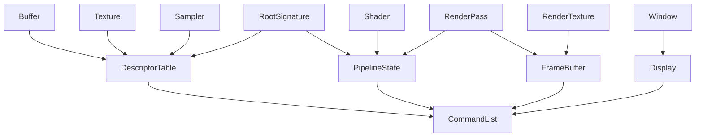
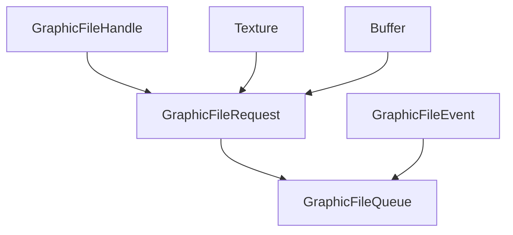

# RHIモジュール

## 概要
RHI (Render Hardware Interface) モジュールは、DirectX12やVulkanなどの異なる描画APIを共通化するためのインターフェイスを提供します。このモジュールは、グラフィックプログラミングの初心者にも理解しやすいように設計されており、GPUリソース管理や描画パイプラインの基本的な概念を学ぶための基盤となります。

RHIモジュールはインターフェイスの定義に特化しており、描画パイプラインやカメラの定義などの高レベルな機能は、上位のGraphics層で実装されます。

## クラスの依存関係
以下に、RHIモジュール内の主要クラス間の依存関係を示します。


```mermaid
graph TD

    Buffer & Texture & Sampler & RootSignature --> DescriptorTable
    RootSignature & Shader & RenderPass --> PipelineState
    RenderTexture & RenderPass --> FrameBuffer
    Window --> Display

    DescriptorTable & PipelineState & FrameBuffer & Display --> CommandList
```
DirectStorageやRTX IOといったGPUとFileIOが強く結びついている機能もRHI層に吸収されています。
これらの機能はID3D12Resourceといった特定のRHI実装に強く依存した機能であるため各RHI実装によって使用できるかどうかが分かれます。

```mermaid
graph TD    
    GraphicFileHandle & Texture & Buffer --> GraphicFileRequest --> GraphicFileQueue
    GraphicFileEvent --> GraphicFileQueue
```

> [!NOTE]  
> FidelityFX Super Resolution ™AMD や YEBiS ™Silicon Studio といった特定のRHI実装に依存するミドルウェアの導入を考えると、DirectStorageも同様に追加のプラグインの実装に移動される可能性があります。

## クラス説明

### RHI
グラフィック・オブジェクトを生成するファクトリクラスです。

> [!WARNING]  
> 複数のRHI実装 (例: DirectX12とVulkan) を同時に使用することはできません。

### Buffer
GPUメモリ上のデータを管理するクラスです。頂点バッファやインデックスバッファなど、描画に必要なデータを格納します。

### Texture
GPUメモリ上のテクスチャデータを管理するクラスです。

### RenderTexture
GPUメモリ上のレンダリング結果を格納するテクスチャです。ポストプロセスやシャドウマップに使用されます。

### Sampler
テクスチャサンプリングの設定を管理します。例えば、フィルタリングモードやアドレッシングモードなどを指定します。

### Shader
シェーダーコードまたはシェーダーバイナリから構築されます。

### RootSignature
シェーダーとリソースのバインディングを定義するクラスです。効率的なリソースアクセスを可能にします。

### PipelineState
描画パイプラインの設定を管理するクラスです。シェーダーステージやラスタライザーステートなどを含みます。

### RenderPass
レンダリング操作を定義するクラスです。複数の描画コマンドをグループ化します。

### FrameBuffer
レンダリング結果を格納するためのバッファです。複数のレンダーターゲットをサポートします。

### DescriptorTable
Texture、Buffer、Samplerといったシェーダーリソースをバインドするためのテーブルです。リソースの効率的な管理をサポートします。

### CommandList
描画コマンドを記録するためのクラスです。これにより、描画パイプラインの効率的な制御が可能になります。

### Display
描画結果を画面に出力するためのクラスです。ウィンドウ管理やスワップチェインの制御を行います。

## インスタンスの生成方法
RHIモジュールのクラスはRHIクラスを通して生成されます。
```c++
Ref<Texture> texture = rhi.createTexture(desc);
```
RHIクラスはシングルトン指定されているため、各クラスのファクトリメソッドを使用して生成することも可能です。
```c++
// RHIクラスのインスタンスを生成しておく
DirectXRHI rhi(/*引数*/);

Ref<Texture> texture = Texture::Create(TextureDesc{});
Ref<Buffer> buffer = Buffer::Create(BufferDesc{});

// 内部的には RHI::Instance().createTexture(TextureDesc{});と同等
// RHIがインスタンス化されていない場合は空のオブジェクトが返る
```
生成したTextureやBufferなどのインスタンスは```Ref<T>```によって参照カウントベースで管理されています。これらはRHIインスタンスの解放までに全て解放されている必要があります。
```c++
Ref<Texture> texture;
{
    DirectXRHI rhi(/*引数*/);

    texture = Texture::Create(TextureDesc{});

    // rhiがtextureより先に解放されるのでNG
}
```

## 基本的な描画フロー
```c++
DirectXRHI rhi(/*引数*/);

// Display
Ref<Display> display;
{
	DisplayDesc desc;
	desc.window = window;
	display = Display::Create(desc);
}

// RenderTexture
Ref<RenderTexture> target;
{
	RenderTextureDesc desc;
	desc.size = display->getDesc().size;
	target = RenderTexture::Create(desc);
}

// Shader
Ref<Shader> vs = Shader::CompileVS(code);
Ref<Shader> ps = Shader::CompilePS(code);

// RootSignature
Ref<RootSignature> signature;
{
	RootSignatureDesc desc{
		{
			Binding::ConstantBuffer(),
		}
	};
	signature = RootSignature::Create(desc);
}

// PipelineState
struct Vertex {
    Vec4 position;
};
Ref<PipelineState> pipeline;
{
	PipelineStateDesc desc;
	desc.colors = { target->format() };
	desc.rootSignature = signature;
	desc.vs = vs;
	desc.ps = ps;
	desc.vertexLayout.attributes = {
		VertexAttribute(Semantic::Position,offsetof(Vert,position),ElementType::Float,4)
	};
	pipeline = PipelineState::Create(desc);
}

// 頂点バッファとインデックスバッファを生成
Ref<Buffer> vertexBuffer;
Ref<Buffer> indexBuffer;
{
    auto desc = BufferDesc::Vertex<Vert>(vertices.size());
    vertexBuffer = Buffer::Create(desc, BlobView(vertices));
}
{
    auto desc = BufferDesc::Vertex<u16>(indices.size());
    indexBuffer = Buffer::Create(desc, BlobView(indices));
}

// 定数バッファを生成
Ref<Buffer> cbuffer;
{
    BufferDesc desc = BufferDesc::Constant(100);
    cbuffer = Buffer::Create(desc,cbufferData);
}

// CommandList
Ref<CommandList> commandList;
{
    CommandListDesc desc;
    desc.type = CommandListType::Graphic;
    commandList = CommandList::Create(desc);
}

// DescriptorTable
Ref<DescriptorTable> table;
{
    DescriptorTableDesc desc;
    desc.rootSignature = signature;
    desc.slot = 0;
    table = DescriptorTable::Create(desc);
}
table->setResource(0, cbuffer);

while(true) {

    rhi.update();

    commandList->begin();
    
    commandList->beginRenderPass({target});
    
    commandList->setPipelineState(pipeline);
    commandList->setVertexBuffer(vertexBuffer);
    commandList->setIndexBuffer(indexBuffer);
    Array<SetDescriptorTableParam, 1> params = {
        SetDescriptorTableParam(table,0),
    };
    cmdList->setRootDesciptorTable(params.data(), params.size());

    DrawIndexedParam param{};
    param.indexCount = indices.size();
    cmdList->drawIndexed(param);
    
    commandList->endRenderPass();
    
	commandList->applyDisplay(display, colorRT);
    
    commandList->end();

    commandList->flush();

}
```

## RHIプラグインの実装
DirectX12やVulkanといったRHIはプラグインとして実装されます。
* Sources/Plugins/DirectX12RHI
* Sources/Plugins/VulkanRHI


## 制限事項
- DirectX12とVulkanの併用はサポートされていません。
- 高度な機能 (例: レイトレーシング) の実装には追加の拡張が必要です。